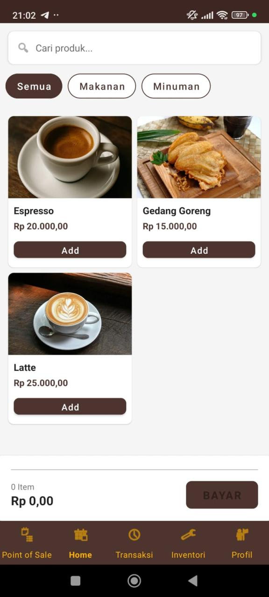
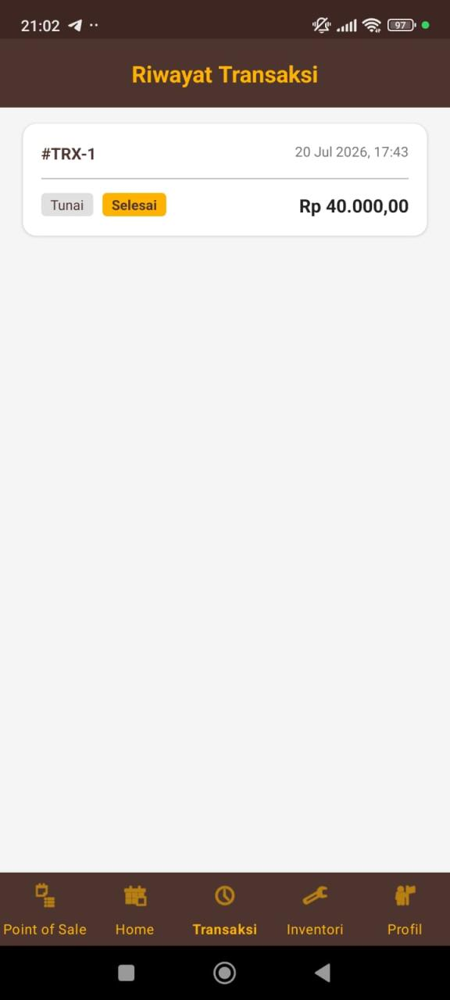

# PillarPOS - Point of Sale System


Sistem Point of Sale (POS) offline-first yang terdiri dari dua bagian: aplikasi Android
(Kotlin) untuk kasir/admin, dan REST API backend (Laravel) sebagai pusat data. Aplikasi
Android dibangun dengan arsitektur MVVM dan mendukung multi-role (admin & kasir), serta
tetap bisa bertransaksi saat koneksi internet terputus berkat sinkronisasi otomatis
menggunakan Room database sebagai local storage.

> Proyek ini dibuat untuk memenuhi tugas akhir mata kuliah Pemrograman Mobile.

## Struktur Repo

```
PillarPos-PointOfSale/
├── PillarPOS/         # Aplikasi Android (Kotlin, MVVM, Room, Retrofit)
└── pillarpos-api/     # REST API Backend (Laravel, PostgreSQL, Sanctum)
```

## Tampilan Aplikasi (Android)

<p align="center">
  
  
  
  
</p>

<p align="center">
  <i>Pilih Peran (Admin/Kasir) &nbsp;&bull;&nbsp; Point of Sale &nbsp;&bull;&nbsp; Dashboard &nbsp;&bull;&nbsp; Riwayat Transaksi</i>
</p>

## Fitur

- Login & Autentikasi dengan API, mendukung role admin dan kasir
- Manajemen Kategori & Produk
- Keranjang Belanja (Cart) dengan perhitungan diskon
- Transaksi Penjualan & Pembayaran
- Void Transaksi
- Dashboard ringkasan penjualan harian (total penjualan, jumlah transaksi, rata-rata per transaksi)
- Sinkronisasi data dengan server (offline-first dengan Room DB)

---

## 1. Aplikasi Android (`PillarPOS/`)

### Persyaratan

- Android Studio Hedgehog (2023.1.1) atau lebih baru
- JDK 17
- Android SDK 34
- Device/Emulator dengan minimum Android 9 (API 28)

### Instalasi & Menjalankan

**1. Buka Project di Android Studio**
File > Open > Pilih folder `PillarPOS`

**2. Sync Gradle**
Tunggu Android Studio selesai sync Gradle secara otomatis. Jika tidak, klik:
File > Sync Project with Gradle Files

**3. Konfigurasi API Base URL**
Buka file konfigurasi API (biasanya di `data/remote/` atau `network/`) dan sesuaikan base URL API:

```kotlin
// Sesuaikan dengan IP address mesin kamu
const val BASE_URL = "http://10.0.2.2:8000/api/"  // Untuk emulator
// const val BASE_URL = "http://<IP_KOMPUTER>:8000/api/"  // Untuk device fisik
```

Catatan untuk emulator: `10.0.2.2` adalah alias untuk localhost komputer host.

**4. Jalankan Aplikasi**
Klik tombol Run di Android Studio atau gunakan shortcut `Shift + F10`, lalu pilih device/emulator yang tersedia.

### Struktur Project Android

```
PillarPOS/
├── app/
│   ├── src/
│   │   ├── main/
│   │   │   ├── java/com/pilarkreasi/pillarpos/
│   │   │   │   ├── data/          # Repository, local DB, remote API
│   │   │   │   ├── ui/            # Activities, ViewModels, Adapters
│   │   │   │   └── util/          # Helper classes
│   │   │   └── res/               # Layouts, drawables, strings
│   │   └── test/                  # Unit tests
│   └── build.gradle.kts
├── build.gradle.kts
└── settings.gradle.kts
```

### Tech Stack Android

| Komponen | Teknologi |
|---|---|
| Bahasa | Kotlin |
| Local Database | Room |
| Networking | Retrofit 2 + Gson |
| Architecture | MVVM |
| Coroutines | Kotlinx Coroutines |
| UI | Android Views + ViewBinding |

### Testing

Jalankan Unit Test dari Android Studio: klik kanan pada folder `app/src/test` > Run Tests

Jalankan dari Terminal:
```bash
# Windows
gradlew.bat test

# macOS/Linux
./gradlew test
```

Jalankan Specific Test Class:
```bash
gradlew.bat test --tests "com.pilarkreasi.pillarpos.ui.main.CartViewModelTest"
```

Test yang Tersedia:

| Test File | Deskripsi |
|---|---|
| CartViewModelTest | Test logika keranjang belanja |
| LoginViewModelTest | Test proses login |
| AuthRepositoryTest | Test repository autentikasi |
| ProductRepositoryTest | Test repository produk |
| SyncRepositoryTest | Test sinkronisasi data |
| DiscountCalculatorTest | Test kalkulasi diskon |

---

## 2. Backend API (`pillarpos-api/`)

### Persyaratan

- PHP 8.1+
- Composer
- PostgreSQL

### Instalasi & Menjalankan

```bash
cd pillarpos-api
composer install
cp .env.example .env
php artisan key:generate
# Sesuaikan koneksi database di file .env
php artisan migrate
php artisan serve
```

Secara default API akan berjalan di `http://127.0.0.1:8000`.

### Tech Stack Backend

| Komponen | Teknologi |
|---|---|
| Framework | Laravel |
| Database | PostgreSQL |
| Autentikasi | Laravel Sanctum |
| Arsitektur | REST API, CRUD Controller per resource (kategori, produk, stok, diskon) |

---

## Catatan Penting

- Pastikan `pillarpos-api` sudah berjalan sebelum menjalankan aplikasi Android
- Untuk device fisik, pastikan komputer dan device berada di jaringan yang sama
- Aplikasi Android mendukung mode offline menggunakan Room database sebagai local storage, dan akan melakukan sinkronisasi otomatis saat kembali online
